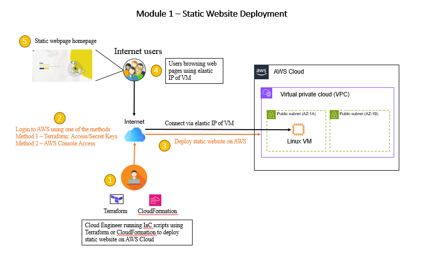

# Summary for module 1 - Deployment

## Overview of module 1 assignment
- For module 1, we are tasked to deploy a static HTML website from the following public github
https://github.com/rswiftoffice/SES-Cloud-Homework
- The static HTML website can be hosted in any three major cloud platforms, namely, Azure, Amazon
Web Services (AWS) and Google Cloud Platform (GCP).

## Architecture Diagram
Please refer to the architecture diagram below




## Pre-requisites for deployment
### Method 1: Terraform
- Terraform
- AWS account and Access/Secret Keys with sufficient IAM permissions to create VPC & EC2 resources (For Terraform only)
- Visual Studio Code (IDE)
### Method 2: AWS CloudFormation
 CloudFormation template
 AWS account with console access and sufficient IAM permissions to create VPC & EC2 resources


## Deployment Environment
- Terraform will be used for provisioning the environment for static HTML website on AWS Cloud. The following resources will be provisioned
- 1 x VPC
- 2 x public subnet (1 in availability zone 1a and 1 in availability zone 1b)
- 2 x security groups (1 for ssh access to VM and 1 for web server access)
- 1 x internet gateway for VM access to public internet
- 1 x RedHat 9 Linux VM with bootscrap scripts to perform setup & installation of Apache webserver and copy the static website contents from public github repository
- 1 x public Elastic IP for accessing the static HTML website


## List of software version used for deployment
- Terraform version v1.7.2
- Visual Studio Code version 1.96.4
- AWS CLI 2.15.16
- AWS CloudFormation

## Directory structure 

```
├── architecture-diagram    (Overall architecture diagram for module 1)
├── tf-env/static-webpage   (Actual environment for provisioning resources for static webpage)
├── tf-modules              (Terraform parent module for AWS cloud)
├── cloudformation          (CloudFormation templates for provisioning resources for static webpage)
├── scripts                 (Bootscrap scripts for VM)
├── execution-logs          (Shows the sample logs for terraform plan, apply and destroy)
```


## Overview of Deployment Steps
### Method 1: Terraform
- Make sure the software pre-requisites has been downloaded/installed and configured on your local machine
- Configure AWS access/secret keys on your local machine
- Change directory to tf-env\static-webpage
- Run the terraform commands to perform initialization
```
terraform init
```
- Run the terraform commands to check the plan
```
terraform plan
```
- Run the terraform commands to apply and create the resources
```
terraform apply
```
- After the resources has been deployed on AWS cloud, get the public ip address from the terraform output or login to AWS to check the public ip address from the provisioned VM. Open a webpage and paste the public ip. The static webpage should load successfully.

### Method 2: CloudFormation
- Open AWS Management Console
- Navigate to CloudFormation services
- On the right pane, select Create stack > With new resources (standard)
- Under Specify template, select "Upload a template file" and click on "Choose file"
- Upload the file from "module1/cloudformation/aws-cf-static-website.yml" and click next
- Enter a stack name and update the parameters if neccessary. Click Next
- Review the stack options and click Next
- Under the "Review and create", review the options and click Submit.
- Wait for the cloudformation stack to complete and click on the "Outputs" tab. It will contain the public elastic ip of the static website