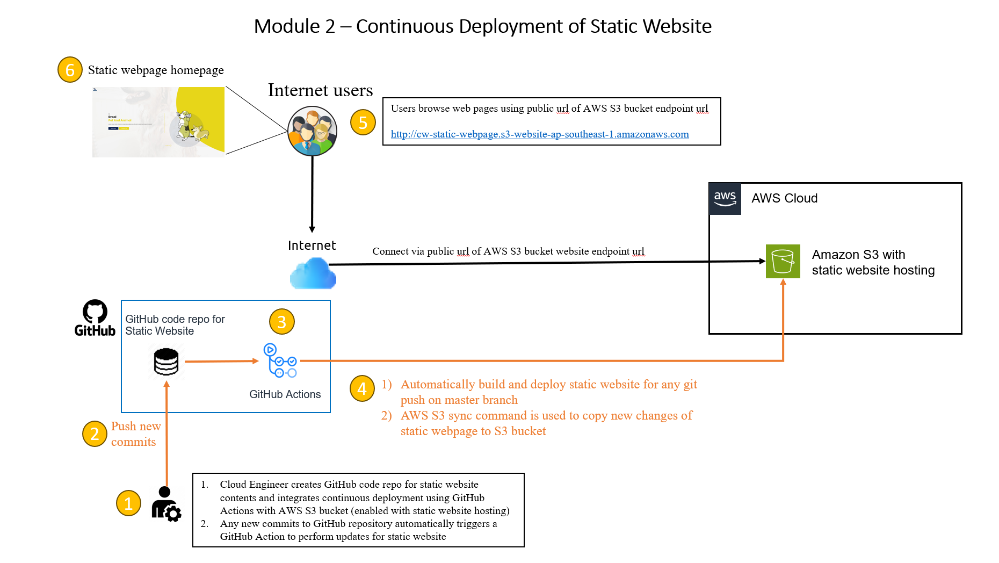

# Summary for module 2 - Continuous Deployment

## Overview of module 2 assignment
- For module 2, we are tasked to setup continuous deployment for the static HTML website from module 1. the public github repository can be found below.
https://github.com/rswiftoffice/SES-Cloud-Homework
- When changes are made to the default branch through GitHub actions, the static website should be able to update itself upon each commit

## Architecture Diagram
Please refer to the architecture diagram below




## Pre-requisites for deployment
- GitHub Account (GitHub Free)
  - GitHub code repository
  - GitHub Actions (CICD)
- AWS Account
  - AWS Access & Secret keys
  - AWS S3 bucket for hosting public website


  ## Deployment Environment
- Please refer to pre-requistes for deployment


## Overview of Deployment Steps
- Summary steps to configure continuous deplyment with static web pages using AWS S3 bucket with static website hosting enabled
    1)	Create a new public github repo (eg. module2-cd-s3)
    2)	Clone the contents of the static website and copy to the new code repository under "public" folder. Push the updates to Github
    3)	Login to AWS account and create a new S3 bucket (eg. cw-static-webpage)
    4)	Enable static website hosting for the S3 bucket using the following aws docs (Step 1 to 4)
    https://docs.aws.amazon.com/AmazonS3/latest/userguide/HostingWebsiteOnS3Setup.html#step2-create-bucket-config-as-website
    5)	Navigate back to the public github repo (eg. module2-cd-s3) and clone the repository to local machine
    ```
    git clone <github-repo-url>
    ```
    6) Add the AWS access and secret keys under Github Settings > Secrets and variables > Actions > Repository secrets
    ```
    AWS_ACCESS_KEY_ID
    AWS_SECRET_ACCESS_KEY
    ```
    7)	Create new sub-folders ".github" for automatic deployment using Github Actions
    ```
    ├── public                        (Contains the static webpage contents)
    ├── .github
        ├── workflows                 (Folder for github actions)
            ├── cicd.yml              (Github actions workflows that performs automatic deployment of webpage during git push to master branch)
    ``` 
    8)	Make some changes in the static webapp contents under "public" folder and push new updates to master branch.
    9)	Github Action will automatically trigger to build and push new updates to public website
    10) Access the static website using the AWS S3 static webpage endpoint url (eg. http://cw-static-webpage.s3-website-ap-southeast-1.amazonaws.com)


    ## Github Repo for Continuous Deployment
    - The public github repo below is used for performing automatic updates to AWS S3 bucket with static webpage hosting enabled 
    - https://github.com/pascalpeh/module2-cd-s3