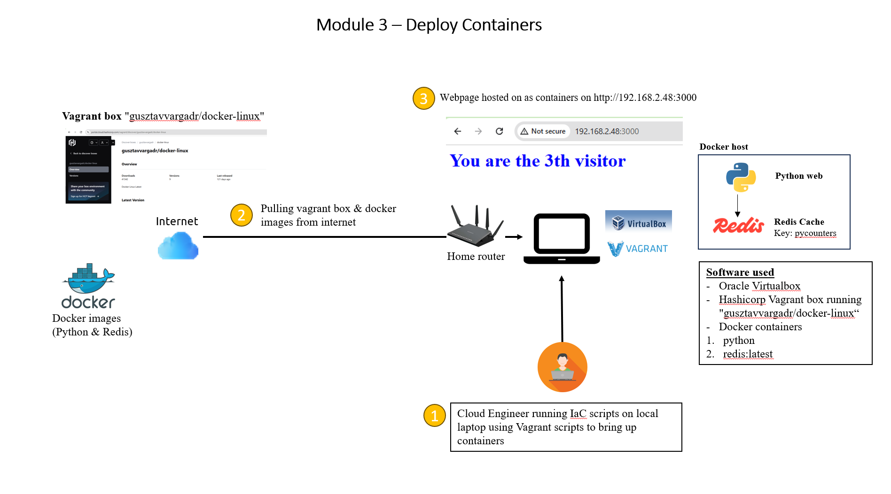

# Summary for module 3 - Containers

## Overview of module 3 assignment
- For module 3, we are tasked to create an application with a webpage that displays the message "You are the xx th visitor,"
where <x> is a counter value obtained from Redis. The counter needs to be incremented with each page visit.


## Architecture Diagram
Please refer to the architecture diagram below




## Pre-requisites for deployment
- Docker
- Notepad editor (such as Visual studio code)
- Oracle virtualbox (For running of virtual machines on local machines)
- Vagrant (For quick deployment of pre-baked VMs from public vagrant boxes. Note that vagrant automatically integrates with Oracle Virtualbox for deployment of VMs)
- Other deployment methods can be used such as using docker desktop


## List of software version used for deployment
- Vagrant version 2.4.3
- Oracle VirtualBox version 7.0
- Vagrant box used -> "gusztavvargadr/docker-linux"


## Directory structure 

```
├── architecture-diagram    (Overall architecture diagram for module 3)
├── vagrant/VagrantFile     (Contains VagrantFile for deploying docker VM)
├── vagrant/script          (Terraform parent module for Azure cloud)
├── scripts                 (Bootscrap scripts for VM)
├── execution-logs          (Shows the sample logs used for deployment of vagrant scripts)
```


## Overview of Deployment Steps
- Create a folder (eg. "webpage-visitor-count") that will be used for deploying a vagrant box running as docker VM
- Change directory to the new folder (eg. "webpage-visitor-count") and copy the ./vagrant/VagrantFile onto the new folder
- Create a subfolder named "script" (eg. vagrant/script) and copy the script "scripts/setup-containers.sh" onto it
- Open a command prompt and change directory to the newly created folder (eg. "webpage-visitor-count")
- Bring up the vagrant box using the following commands
```
cd <folder with Vagrantfile>
vagrant validate
vagrant up
```
- After the deployment has completed, the docker VM will be provisioned and 2 containers will be deployed (One python webpage that shows the number of visitors and one redis that keeps track of number of webpage visitor counts)
- Access the webpage using the url http://192.168.2.48:3000. It will show the number of visitor counts
- Clean up the vagrant box using the following commands
```
vagrant destroy
```