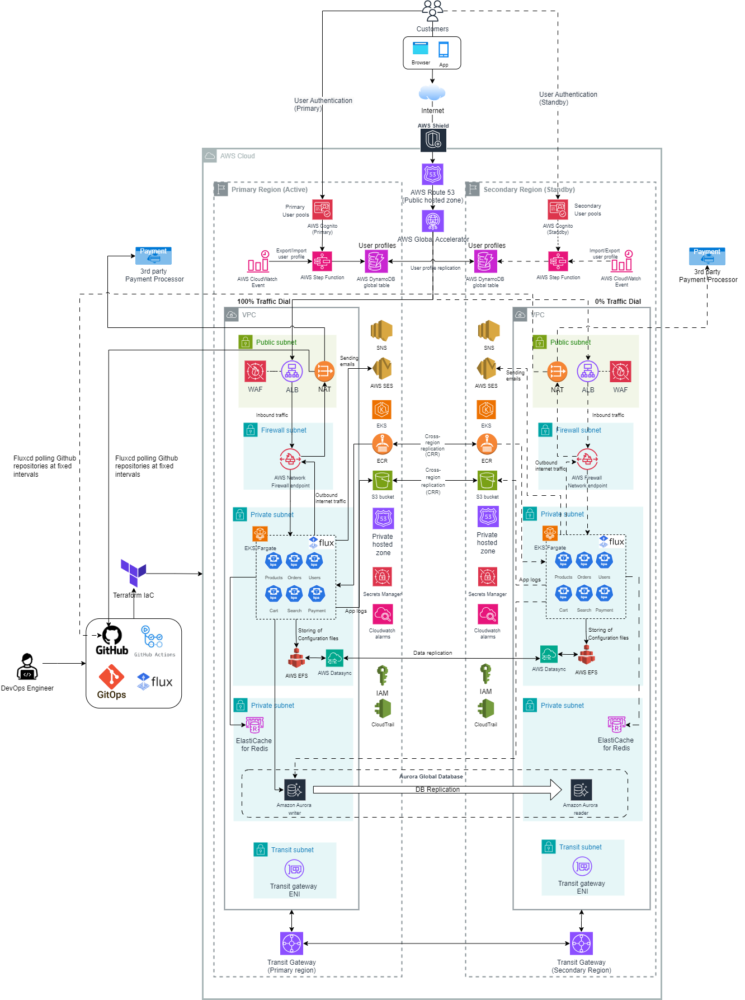
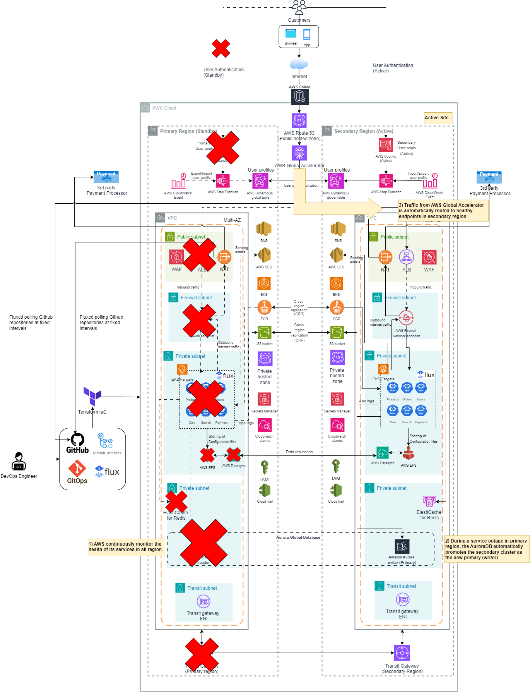

# Summary for module 4 - Solution Architecting

## Overview of module 4 assignment
- For module 4, we are tasked to design a multi-region, highly available, and scalable architecture on Azure, AWS, or GCP for an e-commerce platform which will be expecting heavy loads and implement features such as automatic scaling, load balancing, and disaster recovery. In addition, we need to provide a cost estimation of services used.

## Architecture Diagram
Please refer to the architecture diagram below

## Solution Overview

This diagram illustrates a multi-region active-passive architecture.  Two regions host EKS clusters on Fargate. The primary region is active, using horizontal pod autoscaling, while the secondary region is passive, with standby pods.  Stateful data (application configuration) is stored in EFS and replicated to the secondary region via DataSync. Container images (ECR) and application logs (S3) are also replicated using cross-region replication. FluxCD automates deployments to both EKS clusters by polling a GitHub repository for changes.

AWS Global Accelerator uses endpoint groups in primary and secondary regions, each with an Application Load Balancer.  Normally, all traffic is configured using 100% traffic dial to direct to the primary region's ALB, where it's inspected by AWS WAF and Network Firewall for malicious activity.

AWS Cognito handles user authentication and authorization.  Because Cognito lacks native cross-region replication, user data is periodically exported to a DynamoDB global table in the primary region via CloudWatch Events and Step Functions, then replicated to the secondary region's Cognito user pool.  Okta is also considered as a potential alternative.

AWS AuroraDB Global Database is used, with a write/read instance in the primary region and a read-only instance in the secondary region.  This secondary instance is synchronized with the primary and can be promoted to a write instance in the event of a failover. AWS Route 53 private hosted zones are integrated with the Aurora writer/reader endpoints, providing simplified DNS names for the EKS application to use.

EKS cluster outbound internet traffic is inspected by AWS Firewall endpoints.  Firewall rules, including whitelists of approved domains and FQDNs, determine which traffic is allowed to proceed to the internet via the NAT gateway.

Infrastructure as Code (IaC) tools such as Terraform are utilized for deployment of the setup in the diagram for multi-region so that it allows for version control, automation and repeatability. Furthermore, CI/CD tools, like GitHub Actions and GitOps using Fluxcd are integrated to automate the build, test, and deployment pipelines.

### Components
- AWS Global Accelerator: Provides a single, static entry point (IP addresses or DNS name) for the application. Uses traffic dials to route 100% of traffic to the primary region (active) and 0% to the secondary region (standby).
- AWS Application Load Balancer: The ALB distributes traffic across the EKS pools in each region with the primary region actively serving traffic. The ALB in secondary region is configured in standby mode (routed by AWS Global Accelerator)
- AWS Cognito: AWS Cognito is used for performing user authentication, authorization to the e-commerce platform. 
- AWS EKS (Elastic Kubernetes Service): Application microservices are deployed on AWS EKS with Fargate in both regions. Pods are active with horizontal pod auto-scaling in the primary region, while scaled to zero in the secondary region for cost optimization until failover.
- AWS ECR (Elastic Container Registry): Manages the container images including scanning of software vulnerabilities leveraging the Common Vulnerabilities and Exposures (CVEs) database.
- ElastiCache for Redis: ElastiCache for Redis is deployed in both regions for caching frequently access data to improve application responsiveness
- AWS AuroraDB Global Database: The primary Aurora cluster (writer and reader) resides in the primary region. Read replicas are located in the secondary region which can be promoted as primary during a failover
- AWS Network Firewall: Used for performing ingress/egress network traffic inspection
- AWS EFS: Used for storing of application persistent configuration files
- AWS Datasync: For replication of application configuration files across different region
- AWS S3: For storing of application logs, IaC state files
- AWS SES (Simple Email Service): To allow sending of emails from application
- AWS Shield Standard: AWS Shield Standard provides a basic level of DDoS protection to all AWS customers without any extra cost and it is a valuable first line of defense against common attacks.
- AWS WAF (Web Application Firewall): The WAF is configured with Application load balancers to inspect incoming web requests and helps to protect against common web application attacks such as SQL injection, cross site scripting, etc.
- Monitoring and Alerts: Monitoring dashboard and CloudWatch alarms are configured to monitor for any service failures on the primary region.

## Costs Estimation

The following table shows an estimated cost for both regions per month:

| AWS service  | Description | Cost [USD] |
| ----------- | ------------ | ------------ |
| Elastic Container Registry (ECR) | 10GB per month | $3.80 per month |
| AWS Elastic File System (EFS) | 10GB per month | $9.4 per month |
| AWS DataSync | 10GB per month | $0.26 per month|
| AWS Global Accelerator | Fixed monthly $18 + $0.015 per GB (Assume 10GB) | $18.15 |
| AWS Application Load Balancer | 10GB per month, 10 average number of new connections per second | $43.8 per month|
| AWS Web Application Firewall (WAF) | 1 Web ACL, 10 rules per ACL, 5 managed rule groups per ACL | $52 per month|
| AWS Simple Email Service (SES) | 250000 mail messages sent per month | $26.20 per month |
| AWS ElastiCache | Running on cache.m5.xlarge, 2GB cache data size | $440 per month |
| AWS Simple Storage Service (S3) | S3 standard storage @ 10GB per month | $5.25 per month |
| AWS CloudWatch Logs | 1GB data ingested per month | $1.76 per month |
| AWS Route 53 hosted zone | 2 hosted zones | $1.40 per month |
| AWS Secrets Manager | Number of secrets: 5 | $4.10 per month |
| AWS Cognito | 500 x monthly active users | $13.5 per month |
| AWS Step functions | 500 workflow requests per month |  $6.15 per month | 
| AWS DynamoDB | Data storage size: 10GB | $15.70 per month|
| AWS Transit Gateway | 1 x Transit Gateway attachments, 10GB ingress data processed per month | $102 per month |
| AWS Network Firewall | 1 x Network Firewall endpoint, 100GB data process per month | $580 per month |
| AWS EKS Fargate | 10 pods per day, 0.5 vCPU, GB memory | $225 per month |
| AWS AuroraDB Global Database | Amazon Aurora MySQL-Compatible, 200GB storage | $300 per month |

Total estimated cost: $ 1848.47

## Failover process

Please refer to the architecture diagram during a failover

1) **Continuous Service Monitoring**:  AWS employs CloudWatch to continuously monitor the health and performance of its various services, including databases, load balancers, and network infrastructure deployed across all regions.

2) **Automated AuroraDB Failover**: In the rare event of a regional failure affecting the primary Aurora Global Database cluster, it automatically initiates a failover process, promoting the designated secondary cluster in secondary region to become the new primary (writer) cluster, the failover typically completes less than 30 seconds. Furthermore, AuroraDB offers a fully managed endpoint that automatically updates to reflect the current writer instance after any cross-region switchover or failover. This eliminates the need for application modifications and streamlines routing to the writer instance.

3) **Global Traffic Redirection via Global Accelerator**:   AWS Global Accelerator continuously monitors the health of Application Load Balancers (ALBs) in both the primary and secondary regions, with traffic initially directed 100% to the primary region. Upon a primary region failure, the health checks for its ALBs fail, marking them as unhealthy. Global Accelerator disregards the 100% traffic dial setting during failover. Regardless of the traffic dial configuration, Global Accelerator will consider the secondary region for failover if the primary region is unhealthy. Detecting healthy ALBs in the secondary region, Global Accelerator then redirects all traffic there, making the secondary region the new active site.